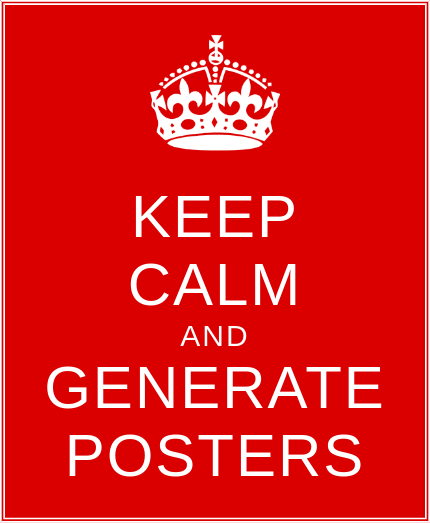

## Generation of "Keep Calm" posters

The files in the `html` subdirectory generate PNG images for posters of the type "Keep calm and carry on".

Typically, you will want to replace "carry on" with your own text. The main page `keep-calm.html` has two buttons:
- "Change Text" is used to replace "carry on" with your own text. Two versions of the posters are displayed. The left-hand side one is an HTML representation. The right-hand side one is the generated PNG image. You may visually verify it.
- "Save PNG" is used to download and save the PNG image. It is the same as sight-click on the PNG file and selected "Save image as..." (depending on your browser).

The `index.html` file is a simple redirection to `keep-calm.html` and is provided as a convenience for direct access on Web servers.

The PNG generation is performed using `html2canvas`. See the [home page](https://html2canvas.hertzen.com/) and the [Github project](https://github.com/niklasvh/html2canvas).

The generation can be used [here](https://lelegard.github.io/keep-calm/).

### Limitations

The files in the `html` subdirectory must be served by an HTTP server and accessed using an `http:` URL. Even though it should work locally in your browser using a `file:` URL, it doesn't. I have reported the problem here: https://github.com/niklasvh/html2canvas/issues/3016

### Sample poster

